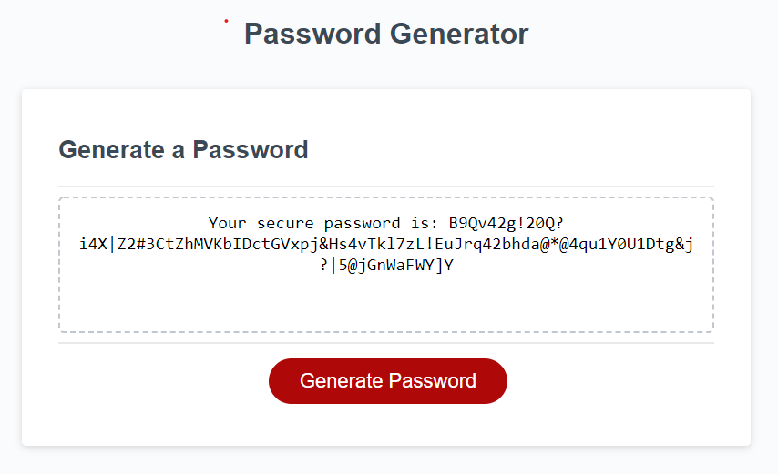

# Password-Generator

## Table of contents
* [General info](#general-info)
* [Technologies](#technologies)
* [Demo](#demo)
* [Project Status](#project-status)
* [Room for Improvement](#room-for-improvement)
* [Contact Me](#contact-me)

## General info

The goal of the project is to create a program that allows employees to create a safe and strong password whenever they need to protect their data. With a series of prompt, they are asked to accept some criteria like the number of characters, the use of symbolsa and numbers and then after they have been validated, a password is created and displayed 

## Technologies

Project is created with:
* HTML
* JavaScript
* CSS

## Demo

## Project Status
* Complete

## Room for Improvement
Room for improvement:
* Optimize input validation 

## Contact me 
Created by [Nico Pasqualini](https://nico749.github.io/Personal-portfolio-/) - feel free to contact me!

